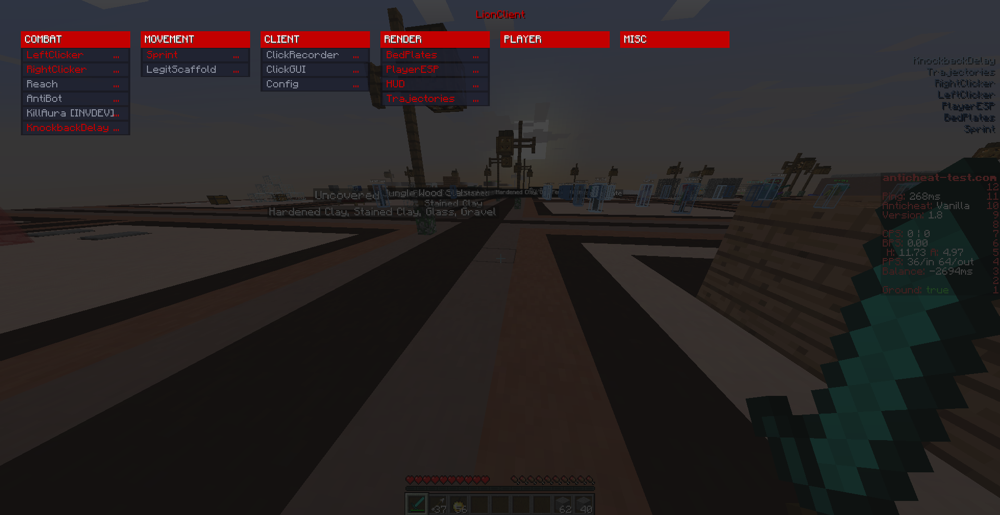
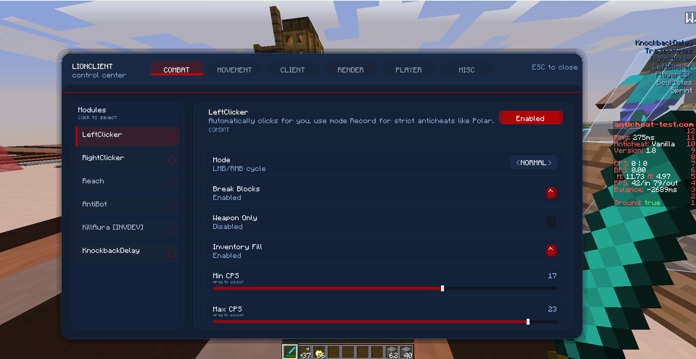

# LionClient

Community-focused utility client with a custom base, and a focused module set.

> LionClient was built partially with AI assistance and uses examples from certain versions of Raven. (No code of Blowsy or raven b4 has been used)

## Highlights

- 15 built-in modules across combat, movement, client, and render
- Two distinct ClickGUI styles: Classic dropdown and Modern panel
- Record mode support through `ClickRecorder`
- Built-in hover descriptions and suggestions for modules

## Quick Start

1. Put the `.jar` into your Minecraft `mods` folder.
2. Launch the game.
3. Press `RSHIFT` to open the ClickGUI.
4. Hover over a module for more than 2 seconds to see its description and suggestions.

## Interface Preview

| Classic | Modern |
| --- | --- |
| Dropdown-style ClickGUI | Panel-style ClickGUI |
|  |  |

## Module List

### Combat

| Module | Description |
| --- | --- |
| `LeftClicker` | Automatically clicks for you and supports Record mode for strict anticheats like Polar. |
| `RightClicker` | Automatically right-clicks for you and supports Record mode for strict anticheats like Polar. |
| `Reach` | Extends attack range. |
| `AntiBot` | Filters NPCs from real players. |
| `KillAura [INVDEV]` | Attacks nearby players and supports Record mode for strict anticheats like Polar. |
| `KnockbackDelay` | Delays packets for a set period after knockback. |

### Movement

| Module | Description |
| --- | --- |
| `Sprint` | Automatically keeps you sprinting. |
| `LegitScaffold` | Sneaks at block edges. |

### Client

| Module | Description |
| --- | --- |
| `ClickRecorder` | Records left-click timings for Record mode. |
| `ClickGUI` | Opens and customizes the ClickGUI. |
| `Config` | Manages saved client configs. |

### Render

| Module | Description |
| --- | --- |
| `BedPlates` | Shows the unique defense blocks around nearby beds. |
| `PlayerESP` | Draws a box around other players through walls. |
| `HUD` | Displays enabled modules on screen. |
| `Trajectories` | Predicts projectile flight paths and highlights entity hits. |
